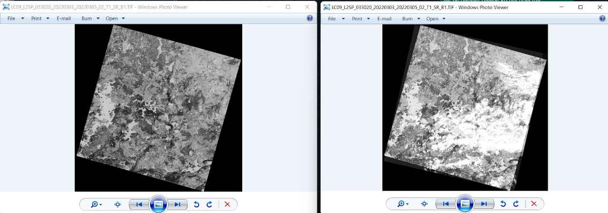
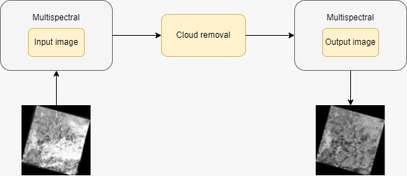

# 
 :satellite: Satellite Image Cloud Removal :fog:

## 🎄 Problem Statement: 
### To remove cloud from multispectral image captured under poor  weather condition.

 

## ✨ Proposed Solution: 
1. ###  Preparation of paired dataset of cloudy and respective non-cloudy multispectral images.

2. ###  Computation of the cloud thickness in each band by using relationship between different bands.

  

3. ###  Using lightweight CNN network (Unet) to generate non-cloudy image corresponding to given cloudy image.

 

## Architecture

## Applications:
1. ###  To accurately predict and smoothen the process of disaster management.
2. ###  To improve visual surveillance based on object detection and minute details on the surface of earth.
3. ###  To assist in detection of terrorist installations at the border of the country.
4. ###  To assist Indian Army for safety of the borders.
5. ###  To monitor patterns of movement under poor atmospheric conditions. 
